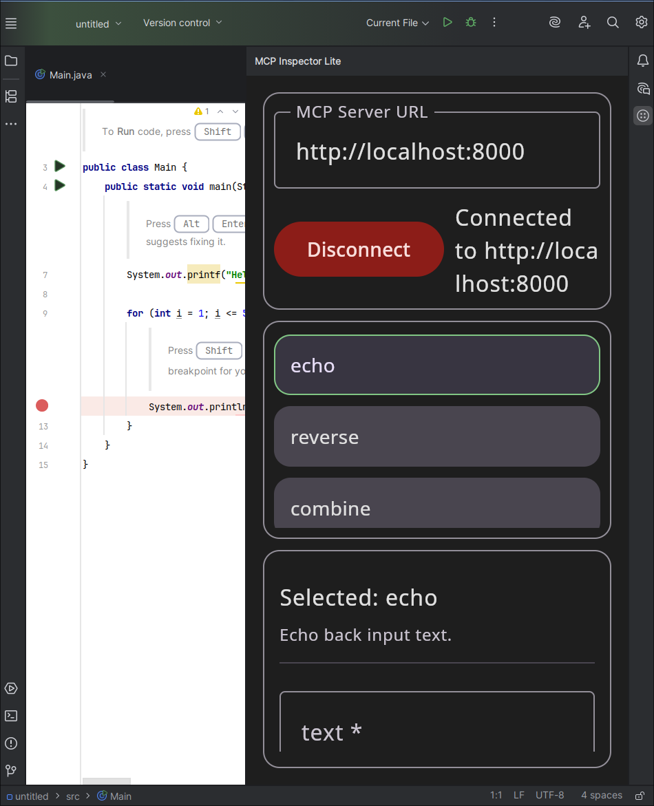

# MCP Inspector Lite

A lightweight IntelliJ/PyCharm plugin that lets developers **connect to an MCP server**, view available tools, and invoke them — all directly inside the IDE.  
It provides a clean, Compose-based interface for inspecting Model Context Protocol (MCP) services.

## Requirements
- **IntelliJ IDEA** (Community or Ultimate) 2023.1 or newer
- **JDK 21+**
- **Gradle** (wrapper included)
- **Python 3.10+**
- **Flask** (`pip install flask`)

## How to run the MCP server
For simplicity, I just used Flask and Python to implement a simple MCP server. To run this you need to install flask, after that you simply run it using the following command. 
```bash
> python3 MockMCPserver.py
```
Make sure that this server is running before you try to run the plugin. 

## Build and run the plugin
### Using Intellij
The easiest way to build and run the plugin is through Intellij 
1. Open the project in IntelliJ IDEA. 
2. Wait for Gradle to sync. 
3. In the right Gradle tool window, expand:
```bash
Tasks → intellij → runIde
```
4. Double-click runIde.
This launches a sandboxed IntelliJ instance with your plugin preloaded.
You should now see your “MCP Inspector Lite” tool window available (usually docked on the right or bottom panel).

### Build a distributable ZIP
You can also build and run it using the command line. 
First you run `./gradlew buildPlugin`
This will produce a distributable `.zip` under:
`build/distributions/mcp_debugger-1.0.0.zip`
You can install this manually in any JetBrains IDE:
- Go to Settings → Plugins → ⚙️ → Install plugin from disk
- Choose the .zip file
- Restart the IDE

## Plugin UI overview

| Section               | Description                                                                                              |
| --------------------- | -------------------------------------------------------------------------------------------------------- |
| **Connection**        | Enter the MCP server URL (default: `http://localhost:8000`) and connect to the running server.           |
| **Tools List**        | Displays available tools fetched from the server once connected.                                         |
| **Details & Results** | Shows details for the selected tool, allows parameter input, and displays the response after invocation. |


Screenshot of the plugin, the panes are made bigger for visibility. The panes are scrollable. 

## AI usage log
https://chatgpt.com/share/690cd22d-cafc-8003-9456-c7705651693a